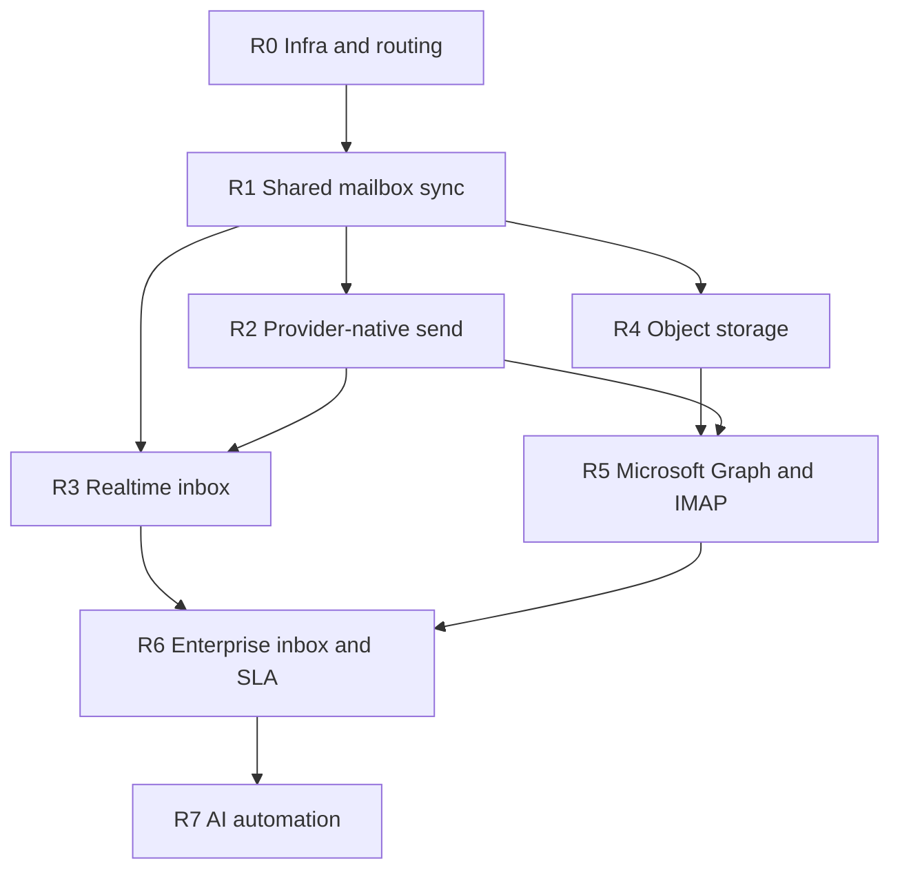

# CRM Email Blueprint — Completion Roadmap

This roadmap closes the gap between the **Final CRM Email Architecture Development Blueprint** (18-page ArivuSystems spec) and **LiteDesk** as implemented today.

**Related docs**

| Document | Purpose |
|----------|---------|
| [COMMUNICATION_PLATFORM_PHASE_PLAN.md](./COMMUNICATION_PLATFORM_PHASE_PLAN.md) | What is already shipped (Phases 0–6, internal numbering) |
| [CRM_EMAIL_ENTERPRISE_ARCHITECTURE.md](./CRM_EMAIL_ENTERPRISE_ARCHITECTURE.md) | Enterprise reply routing, collections, flows |
| [IN_PRODUCT_EMAIL_PLAN.md](../../docs/IN_PRODUCT_EMAIL_PLAN.md) | Reply-To token design |
| [PHASE2_INBOUND_SETUP.md](../../docs/PHASE2_INBOUND_SETUP.md) | Inbound webhook operator setup |

**Legend:** ✅ Done · 🟡 Partial · ⬜ Not started

---

## 1. North star (from blueprint)

| Concern | Blueprint target | LiteDesk today |
|---------|------------------|----------------|
| **Receive (team)** | Google Workspace → Gmail API → sync worker → MongoDB → Inbox UI | ✅ Group Gmail OAuth + sync (R1) |
| **Receive (personal)** | Gmail / Graph OAuth → sync worker | 🟡 Gmail personal ✅; Outlook/IMAP ⬜ |
| **Send (agent)** | Gmail API / Graph API (native Sent + threading) | 🟡 SMTP/SES/Resend/OCI queue — **not provider APIs** |
| **Send (system)** | OCI Email Delivery only | 🟡 Multi-provider; OCI supported |
| **Reply routing** | `reply+TOKEN@reply.domain` → central inbox → tenant DB | ✅ Short tokens + `email_threads` master registry + legacy HMAC |
| **Realtime inbox** | WebSocket or SSE | 🟡 Cron ~5 min + manual refresh |
| **Attachments** | OCI Object Storage; metadata in MongoDB | 🟡 Local `uploads/` |
| **Phase 3** | Tickets, SLA, AI, assignment rules, analytics | 🟡 Create-case + triage hints only |

---

## 2. Roadmap overview

Phases are ordered by **dependency**. Internal platform phases 0–5 are **complete**; this roadmap continues from **Blueprint Phase 1 gaps** forward.



| Phase | Name | Blueprint alignment | Effort (indicative) |
|-------|------|---------------------|---------------------|
| **R0** | Infrastructure & routing | Reply domain, DNS, system-mail sender | 1–2 weeks |
| **R1** | Shared mailbox sync | Blueprint Phase 1 | 3–4 weeks |
| **R2** | Provider-native send | Blueprint Phase 1–2 (sent sync) | 3–4 weeks |
| **R3** | Realtime inbox | Blueprint Phase 2 | 2–3 weeks |
| **R4** | Attachment object storage | Blueprint stack | 1–2 weeks |
| **R5** | Microsoft Graph + IMAP | Blueprint Phase 2 providers | 4–6 weeks |
| **R6** | Enterprise inbox & SLA | Blueprint Phase 3 (partial) | 4–6 weeks |
| **R7** | AI automation | Blueprint Phase 3 | 4+ weeks (ongoing) |

---

## 3. Completed foundation (do not re-build)

Treat these as **stable platform**; extend, don’t replace.

- ✅ Outbound platform (contract, queue, idempotency, events, suppressions, webhooks)
- ✅ Inbound platform (parser, thread resolver, dispatcher, dead-letter, diagnostics)
- ✅ Reply-To routing: short tokens (`email_threads` master) + legacy HMAC (`replyToTokenService`)
- ✅ Workspace inbox API + `/inbox` UI (filters, search, snooze, bulk triage)
- ✅ Personal Gmail OAuth + sync + scheduler (`mailboxGmailInboxSyncService`)
- ✅ `Mailbox` personal/group model + inbound routing by address
- ✅ Thread productivity (reply, assign, tags, done, create task/case)
- ✅ Multi-tenant MongoDB (master + tenant DBs)

---

## R0 — Infrastructure & routing

**Goal:** Production-grade DNS, central reply routing, and a clear split between **system mail** (OCI) and **CRM/agent mail** (provider APIs, starting R2).

### Deliverables

| # | Item | Owner | Status |
|---|------|-------|--------|
| R0.1 | DNS: `reply.<domain>` → inbound relay or Workspace catch-all | Ops | ⬜ Runbook: [R0_EMAIL_INFRA_RUNBOOK.md](./R0_EMAIL_INFRA_RUNBOOK.md) |
| R0.2 | Central routing mailbox `inbox@reply.<domain>` + catch-all `reply+*` | Ops | ⬜ Runbook §2 |
| R0.3 | Wire relay → `POST /api/webhooks/email/inbound` (secret + org resolution) | Ops + Backend | 🟡 `GET …/inbound/health`, `EMAIL_INBOUND_REQUIRE_REPLY_TOKEN`, `reply+` alias |
| R0.4 | SPF/DKIM/DMARC for **system** sender (`mail.<domain>` / OCI) | Ops | ⬜ Runbook §4 |
| R0.5 | SPF/DKIM/DMARC for **Workspace** sending domains (shared mailboxes) | Ops | ⬜ Runbook §4 |
| R0.6 | Document env matrix in `.env.example`: system vs CRM send paths | Docs | ✅ |
| R0.7 | **OCI Email Delivery** as default for `notificationChannel`, OTP, password reset | Backend | ✅ `sendSystemEmail` + `SYSTEM_EMAIL_*` |
| R0.8 | Policy flag: `CommunicationConfig` — forbid SMTP for `moduleKey: workspace` once R2 ships | Backend | ✅ `disallowPlatformSmtpForWorkspace` |

### Acceptance criteria

- Test reply to `reply+TOKEN@reply.<domain>` lands in tenant DB within SLA (e.g. &lt; 60s with queue).
- System emails send only via OCI (or documented exception in dev).
- Runbook exists for rotating `EMAIL_REPLY_TOKEN_SECRET` and `MAILBOX_OAUTH_SECRET`.

### Env / ops checklist

```bash
EMAIL_REPLY_TOKEN_SECRET=...
EMAIL_INBOUND_ADDRESS=inbox@reply.yourdomain.com
EMAIL_REPLY_TO_DOMAIN=reply.yourdomain.com
EMAIL_PROVIDER=oci-email          # system mail
OCI_EMAIL_REGION=...
# Gmail (personal + shared): GOOGLE_GMAIL_* or tenant CommunicationConfig
```

---

## R1 — Shared mailbox sync (Blueprint Phase 1)

**Goal:** `support@acme.com` style mailboxes sync via **Gmail API** into CRM, same reliability as personal sync.

**Depends on:** R0 (Workspace mailboxes exist), R0.3 inbound optional for hybrid.

### Backend

| # | Task | Notes |
|---|------|-------|
| R1.1 | Extend `Mailbox.kind === 'group'` for OAuth + encrypted refresh | Mirror personal fields; admin-only connect | ✅ |
| R1.2 | `gmailInboxSyncGoogleStart` / callback for group mailboxes | Per-mailbox OAuth (admin) | ✅ |
| R1.3 | Reuse `runGmailInboxSyncForMailbox` with group ACL checks | `mailboxAccessService` for members | ✅ |
| R1.4 | Store `providerThreadId` on `Communication` (Gmail `threadId`) | Blueprint dual-ID model | ✅ |
| R1.5 | Optional master DB index: mailbox registry in `arivu_master` | Only if cross-tenant ops tooling needed | ⬜ |
| R1.6 | Scheduler includes active `group` mailboxes with `inboxProvider: google` | Same cron as personal | ✅ |
| R1.7 | Increase `MAX_MESSAGES_PER_RUN` / backoff for high-volume shared inboxes | Configurable per mailbox | ✅ |

### Frontend

| # | Task | Notes |
|---|------|-------|
| R1.8 | Settings → Mailboxes → **Connect shared mailbox** wizard | Blueprint Step 1–5 | ✅ |
| R1.9 | Inbox left rail: **Shared** section (Support, Sales, …) | Blueprint UI tree | 🟡 |
| R1.10 | Show sync status / last error on group mailbox rows | Gmail on/off chip | ✅ |

### Tests

- Integration: connect group mailbox (mock Gmail) → import → `providerMessageKey` dedupe.
- ACL: non-member cannot sync or view group threads.

### Acceptance criteria

- New email to connected `support@tenant.com` appears in `/inbox` under that mailbox without manual refresh (R3 enhances latency).
- No duplicate imports for same Gmail message id.
- Tenant A cannot read Tenant B group mailbox data.

---

## R2 — Provider-native send (Blueprint Phase 1–2)

**Goal:** Agent replies send through **Gmail API** (and later Graph), not SMTP — so **Sent folder** and provider threading stay correct.

**Depends on:** R1 for shared; personal OAuth already exists.

### Backend

| # | Task | Notes |
|---|------|-------|
| R2.1 | `platform/communication/providers/gmailSendProvider.js` | `users.messages.send` with raw MIME | ✅ |
| R2.2 | `platform/communication/providers/graphSendProvider.js` | Stub until R5 | ✅ stub |
| R2.3 | Send router: if `mailboxId` + provider connected → provider send; else → existing queue (system/template) | Blueprint split | ✅ `outboundEmailSendService` |
| R2.4 | Inject `Reply-To` via `replyToTokenService` on provider sends | Required for inbound correlation | ✅ |
| R2.5 | Set `From` to mailbox `emailAddress`; store `providerMessageId`, `providerThreadId` | | ✅ |
| R2.6 | **Sent folder sync** job: poll `SENT` label or send response metadata | Blueprint Phase 2 | optional (Gmail API send writes Sent) |
| R2.7 | Deprecate SMTP path for record/workspace replies when mailbox bound | Feature flag per tenant | ✅ policy flags enforced |

### Frontend

| # | Task | Notes |
|---|------|-------|
| R2.8 | Compose drawer: show sending mailbox (shared vs personal) | | ✅ Inbox compose |
| R2.9 | Error UX for OAuth revoked / insufficient scope | Link to reconnect | ✅ reconnect prompt on send/sync errors |

### Acceptance criteria

- Reply from CRM appears in Gmail **Sent** for that mailbox within 2 minutes.
- `In-Reply-To` / `References` preserved; thread groups correctly in CRM and Gmail.
- System notifications still use OCI (never Gmail API).

---

## R3 — Realtime inbox (Blueprint Phase 2)

**Goal:** Inbox UI updates when mail arrives without user refresh.

**Depends on:** R1/R2 stable sync paths.

### Options (pick one in implementation)

| Approach | Pros | Cons |
|----------|------|------|
| **A. Gmail Pub/Sub push** | True realtime for Google | Google Cloud setup, webhook endpoint |
| **B. SSE from API** | Simple, works all providers | Still poll-driven unless push behind it |
| **C. Short poll + SSE notify** | Minimal infra change | Not true push |

**Recommended:** A for Google mailboxes + B for UI (SSE channel `inbox:updated`).

### Deliverables

| # | Task |
|---|------|
| R3.1 | `POST /api/webhooks/gmail/push` (Pub/Sub) → enqueue sync for mailbox | ✅ see `R3_GMAIL_PUSH_SETUP.md` |
| R3.2 | `inboxRealtimeService` — emit per-user events (org + mailbox ACL) | ✅ |
| R3.3 | Client: subscribe on `/inbox` mount; patch thread list / counts | ✅ |
| R3.4 | Notification bell pattern reuse (`NotificationBell` SSE) as reference | ✅ `inboxSSEHub` |
| R3.5 | Fallback: keep cron if push disabled | ✅ scheduler unchanged |

### Acceptance criteria

- New message visible in open Inbox within **10s** (p95) with push enabled.
- No cross-tenant event leakage (integration test).

---

## R4 — Attachment object storage

**Goal:** Attachments off MongoDB and local disk → **OCI Object Storage** (blueprint-compliant).

| # | Task |
|---|------|
| R4.1 | `fileStorageService` adapter: `ociObjectStorage` + retain local for dev |
| R4.2 | Inbound `persistAttachments` → upload stream to bucket; store URL + metadata on `Communication` |
| R4.3 | Outbound read path for provider send |
| R4.4 | Signed URL or API proxy download for UI |
| R4.5 | Migration script: copy existing `uploads/` → bucket; rewrite `storagePath` |
| R4.6 | Lifecycle policy (e.g. 90-day delete for orphaned objects) |

### Env

```bash
OCI_OBJECT_STORAGE_NAMESPACE=...
OCI_OBJECT_STORAGE_BUCKET=...
OCI_OBJECT_STORAGE_REGION=...
ATTACHMENT_STORAGE_DRIVER=oci|local
```

---

## R5 — Microsoft Graph & IMAP (Blueprint Phase 2)

**Goal:** Outlook / Microsoft 365 parity with Gmail.

| # | Task | Priority |
|---|------|----------|
| R5.1 | Azure app registration + Graph scopes documented | P0 |
| R5.2 | `inboxProvider: microsoft` on `Mailbox` | P0 |
| R5.3 | OAuth start/callback (personal + group) | P0 |
| R5.4 | `mailboxGraphInboxSyncService` — delta sync + `providerMessageKey: graph:{id}` | P0 |
| R5.5 | Graph send provider (pairs with R2.2) | P0 |
| R5.6 | Update `inboxProviders.js` → `status: available` | P1 |
| R5.7 | Generic IMAP ingest (poll) for “any provider” | P2 |
| R5.8 | Yahoo / other placeholders — hide or implement | P3 |

**Reuse:** `forcedWorkspaceInbox` ingest path in `inboundDispatcher.js` (same as Gmail).

---

## R6 — Enterprise inbox & SLA (Blueprint Phase 3)

**Goal:** Helpdesk-grade workflows beyond triage hints.

| # | Area | Tasks |
|---|------|-------|
| R6.1 | **Cases** | Email → case with SLA clock, status, queue, priority rules |
| R6.2 | **SLA engine** | Policies: first response, resolution; breach notifications |
| R6.3 | **Assignment rules** | Round-robin / load-based by mailbox or tag |
| R6.4 | **Analytics** | Mailbox volume, response time, SLA compliance dashboards |
| R6.5 | **Audit** | Immutable log for assign/status changes on threads |
| R6.6 | **Master metadata** | ✅ `email_threads` in `arivu_master` (`EmailThreadRegistry`) |

Build on existing: `create-case` API, `slaHint`/`priorityHint`, snooze, assign/tags.

---

## R7 — AI automation (Blueprint Phase 3)

**Goal:** AI-ready architecture → implemented features.

| # | Task | Notes |
|---|------|-------|
| R7.1 | Thread summary API (provider-agnostic context bundle) | No PII in logs |
| R7.2 | Suggested reply draft (human approval required) | |
| R7.3 | Auto-tag / priority classification | Extend `workspaceThreadSummariesService` |
| R7.4 | Sentiment / escalation flags → notification rules | |
| R7.5 | Tenant opt-in + rate limits in `CommunicationConfig` | |

**Prerequisite:** R1–R3 stable; legal/privacy review for data sent to LLM.

---

## 4. Cross-cutting work (all phases)

### Security

| Item | Phase |
|------|-------|
| OAuth token encryption (existing) | ✅ |
| Refresh token rotation policy + disconnect on 401 | R1–R5 |
| Provider webhook HMAC (beyond shared Bearer) | R0–R3 |
| Rate limits on sync endpoints | R1 |
| Audit: who connected/disconnected mailboxes | R1 |

### Testing

| Suite | Phase |
|-------|-------|
| `npm run test:communications-threads` | Maintain |
| `COMMUNICATIONS_HTTP_INTEGRATION=1` — extend for group mailbox + provider send | R1–R2 |
| Gmail/Graph sandbox integration (optional nightly) | R1–R5 |
| Load test: 10k messages import per tenant | R1 |

### Data / migration

| Item | Phase |
|------|-------|
| Backfill `CommunicationEvent` for legacy inbound | Anytime |
| Backfill `providerThreadId` from Gmail metadata | R1 |
| `clearWorkspaceEmails.js` runbook for QA | ✅ exists |

---

## 5. Suggested execution order (quarters)

### Quarter A — Blueprint Phase 1 complete

1. **R0** (2 weeks) — parallel with early R1 dev  
2. **R1** (3–4 weeks) — shared mailbox Gmail sync  
3. **R2** (3–4 weeks) — provider-native send + Sent sync  

**Exit:** Team can use shared `support@` in CRM end-to-end with correct reply routing.

### Quarter B — Blueprint Phase 2 complete

4. **R3** (2–3 weeks) — realtime  
5. **R4** (1–2 weeks) — OCI attachments  
6. **R5** start (4+ weeks) — Microsoft Graph  

**Exit:** Outlook users onboard; inbox feels live; attachments production-safe.

### Quarter C — Blueprint Phase 3

7. **R5** finish + IMAP if needed  
8. **R6** (4–6 weeks) — SLA + cases + analytics  
9. **R7** (incremental) — AI features behind flags  

---

## 6. Definition of done (full blueprint)

The blueprint is **complete** when all of the following are true:

- [ ] Shared and personal mailboxes connect via OAuth (Google + Microsoft minimum).
- [ ] Inbound sync uses provider APIs (not only MIME webhook) for connected mailboxes.
- [ ] Agent outbound uses provider APIs; system mail uses OCI only.
- [ ] Reply-To tokens route customer replies to correct tenant/mailbox/conversation.
- [ ] Inbox UI updates in near-realtime on new mail.
- [ ] Attachments stored in OCI Object Storage; MongoDB holds metadata only.
- [ ] SPF/DKIM/DMARC documented and verified for send + reply domains.
- [ ] Cases + SLA policies + assignment rules operational for support teams.
- [ ] AI features opt-in with human-in-the-loop for sends.

---

## 7. Tracking

Update this file when a roadmap item ships. Mirror major milestones in [COMMUNICATION_PLATFORM_PHASE_PLAN.md](./COMMUNICATION_PLATFORM_PHASE_PLAN.md) as **Phase 7+** entries to keep a single chronological log.

| Roadmap phase | Platform phase plan label (suggested) |
|---------------|--------------------------------------|
| R0 | Phase 7 — Infra & routing |
| R1 | Phase 8 — Shared mailbox sync |
| R2 | Phase 9 — Provider-native send |
| R3 | Phase 10 — Realtime inbox |
| R4 | Phase 11 — Object storage |
| R5 | Phase 12 — Graph & IMAP |
| R6 | Phase 13 — SLA & enterprise inbox |
| R7 | Phase 14 — AI automation |

---

*Last updated: 2026-05-16*
