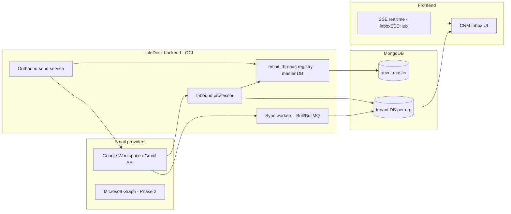
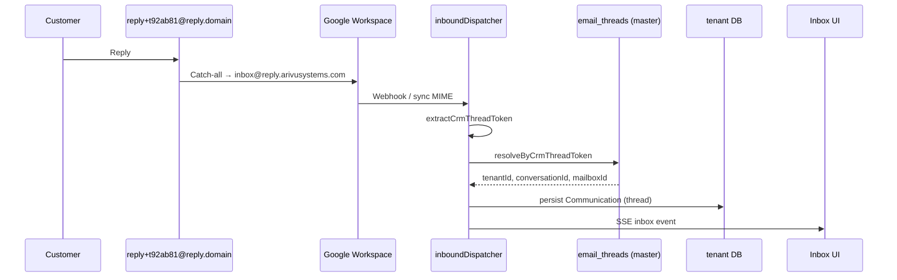

# Enterprise CRM Email Architecture

This document describes how LiteDesk implements the enterprise-grade CRM email reply handling architecture: shared and personal mailbox sync, multi-tenant data isolation, centralized reply routing, and phased delivery.

**Related:** [CRM_EMAIL_BLUEPRINT_ROADMAP.md](./CRM_EMAIL_BLUEPRINT_ROADMAP.md) · [R3_GMAIL_PUSH_SETUP.md](./R3_GMAIL_PUSH_SETUP.md) · [IN_PRODUCT_EMAIL_PLAN.md](../../docs/IN_PRODUCT_EMAIL_PLAN.md)

---

## 1. Architecture overview



| Layer | Technology |
|-------|------------|
| Frontend | Vue 3 (Vercel-ready) |
| API / workers | Node.js on OCI |
| Master routing | MongoDB `arivu_master` |
| Tenant email data | Per-tenant MongoDB (`communications`, attachments metadata) |
| Queue | Bull + Redis (BullMQ migration planned) |
| Shared/personal receive | Gmail API (Microsoft Graph Phase 2) |
| System mail (OTP, reset) | OCI Email Delivery |
| CRM/agent mail default | Resend or tenant SMTP / Gmail API |
| Realtime inbox | Server-Sent Events (`inboxSSEHub`) |

---

## 2. Multi-tenant data model

### Master database (`arivu_master`)

| Collection | Purpose | Status |
|------------|---------|--------|
| `organizations` | Tenants | ✅ |
| `mailboxes` | Shared + personal mailbox OAuth credentials | ✅ (`Mailbox` model) |
| `email_threads` | Short reply token → tenant/conversation routing | ✅ Phase 1 |

**`email_threads` document shape:**

```json
{
  "crmThreadToken": "t92ab81",
  "tenantId": "ObjectId",
  "conversationId": "ObjectId",
  "mailboxId": "ObjectId",
  "mailboxType": "shared | personal | none",
  "provider": "gmail | microsoft | imap | none",
  "providerThreadId": "gmail_thread_abc123",
  "moduleKey": "people",
  "recordId": "ObjectId",
  "sentByUserId": "ObjectId",
  "rootCommunicationId": "ObjectId"
}
```

Implementation: `server/models/EmailThreadRegistry.js`, `server/services/emailThreadRegistryService.js`.

### Tenant database (per organization)

| Logical name | Implementation today |
|--------------|----------------------|
| `conversations` | `Communication.threadId` (thread root) |
| `emails` | `communications` collection |
| `attachments` | Embedded on `Communication.attachments` + local `uploads/` (OCI Object Storage Phase 2) |

Tenant isolation: `organizationId` on all tenant queries; dedicated tenant DB when `organization.database` is set (`databaseConnectionManager`).

---

## 3. Mailbox types

### Shared mailboxes (team)

Examples: `support@company.com`, `sales@company.com`, `billing@company.com`.

- Connect via **Google OAuth** (`Mailbox.kind === 'group'`).
- Sync: inbox, sent, threads, attachments, read/unread via `mailboxGmailInboxSyncService`.
- Gmail push notifications: see [R3_GMAIL_PUSH_SETUP.md](./R3_GMAIL_PUSH_SETUP.md).

### Personal mailboxes

- Per-user OAuth Gmail (`Mailbox.kind === 'personal'`).
- Stored: provider, email, encrypted access/refresh tokens.
- Same sync surface as shared (inbox, sent, replies, attachments).

### Microsoft Graph / IMAP

- UI placeholders exist; provider sync stub: `server/services/microsoftGraphMailboxStub.js` (Phase 2).

---

## 4. Centralized reply routing

**Policy: CRM always controls `Reply-To`.** Personal mailbox addresses are never used as `Reply-To`.

### Outbound example

```
From:     support@company.com
Reply-To: reply+t92ab81@reply.arivusystems.com
```

### Google Workspace catch-all (operations)

Configure in Google Admin:

1. **Catch-all:** `*@reply.arivusystems.com` → `inbox@reply.arivusystems.com`
2. **Routing inbox:** `inbox@reply.arivusystems.com` receives all CRM replies.
3. **Inbound to LiteDesk:** MIME webhook or Gmail sync of the routing inbox → `inboundDispatcher`.

### Token formats

| Format | Example | Use |
|--------|---------|-----|
| **Short (default)** | `reply+t92ab81@reply.arivusystems.com` | Master `email_threads` lookup |
| **Legacy HMAC** | `replies+{payload}.{sig}@domain` | Backward compatible when `EMAIL_REPLY_USE_SHORT_TOKEN=false` |

Env vars:

| Variable | Purpose |
|----------|---------|
| `EMAIL_REPLY_USE_SHORT_TOKEN` | `true` (default) → short tokens |
| `EMAIL_REPLY_TO_DOMAIN` / `CRM_REPLY_DOMAIN` | Reply domain |
| `EMAIL_INBOUND_ADDRESS` | Full routing inbox (domain inferred) |
| `EMAIL_REPLY_TOKEN_SECRET` | Legacy HMAC signing |
| `EMAIL_INBOUND_REQUIRE_REPLY_TOKEN` | Reject inbound without valid token |

---

## 5. Reply processing flow



**Code path:**

1. `replyToTokenService.extractFromAddresses()` — detect `tokenType: 'short' | 'legacy'`
2. `emailThreadRegistryService.resolveByCrmThreadToken()` — master lookup
3. `threadResolver.resolveThread({ preferredThreadId })` — attach to CRM conversation
4. `inboundDispatcher.processRawInbound()` — persist + activity + events

---

## 6. Outbound send strategy

| Mail type | Channel |
|-----------|---------|
| Shared mailbox send | Gmail API (`sendViaGmail`) |
| Personal mailbox send | Gmail API or Gmail SMTP app password |
| CRM default (no mailbox) | Resend / tenant SMTP / SES |
| System (OTP, password reset, notifications) | OCI Email Delivery (`sendSystemEmail`) |

After Gmail send, `updateProviderThreadId()` syncs `providerThreadId` into `email_threads`.

`buildReplyToForDoc()` in `outboundEmailSendService.js` calls `ensureReplyToForCommunication()` — never the user's personal reply address.

---

## 7. Background workers

| Worker | Queue | Responsibilities |
|--------|-------|------------------|
| Inbound | `inbound-email` (Bull) | Parse MIME, route token, persist |
| Outbound | outbound queue | Send, idempotency, webhooks |
| Gmail sync | scheduler + push | Inbox/sent/thread/attachment sync |
| **Planned** | BullMQ | Dedicated sync/reply/attachment workers |

Realtime: `inboxSSEHub` emits on new/updated communications (Socket.IO optional for multi-node).

---

## 8. Security

| Control | Implementation |
|---------|----------------|
| OAuth token encryption | Mailbox encrypted token fields |
| Refresh token rotation | Gmail OAuth refresh in sync/send services |
| Reply token secrecy | Short opaque tokens + master registry; legacy HMAC |
| SPF/DKIM/DMARC | DNS on `reply.arivusystems.com` and tenant sending domains (ops) |
| Inbound token requirement | `EMAIL_INBOUND_REQUIRE_REPLY_TOKEN=true` in production catch-all mode |

---

## 9. Attachments

**Current:** Files written under `uploads/{orgId}/`; metadata on `Communication`.

**Phase 2:** OCI Object Storage — store URL, mime type, size only in MongoDB.

---

## 10. Development phases

### Phase 1 (current focus) ✅ / 🟡

- [x] Shared Gmail OAuth mailbox sync
- [x] Personal Gmail OAuth sync
- [x] Inbox UI (`InboxSurface`, workspace communications API)
- [x] Short reply tokens + `email_threads` master registry
- [x] Inbound dispatcher + thread resolver (`preferredThreadId`)
- [x] Outbound Reply-To injection
- [x] Compose preview (From + Reply-To placeholder)
- [ ] Microsoft Graph shared/personal sync
- [ ] BullMQ worker split
- [ ] OCI attachment storage

### Phase 2

- Personal Outlook / Microsoft 365 OAuth
- Attachment sync to object storage
- BullMQ migration + reply processor worker
- Multi-instance SSE (Redis pub/sub)

### Phase 3

- AI triage / suggested replies
- Cases / SLA workflows
- Assignment rules and analytics

---

## 11. Key source files

| Area | Path |
|------|------|
| Reply domain constants | `server/constants/emailReplyRouting.js` |
| Master thread registry | `server/models/EmailThreadRegistry.js` |
| Registry service | `server/services/emailThreadRegistryService.js` |
| Token parse (short + legacy) | `server/services/replyToTokenService.js` |
| Inbound routing | `server/platform/communication/inbound/inboundDispatcher.js` |
| Thread attachment | `server/platform/communication/inbound/threadResolver.js` |
| Outbound Reply-To | `server/platform/communication/outbound/outboundEmailSendService.js` |
| Gmail sync | `server/services/mailboxGmailInboxSyncService.js` |
| Compose preview API | `GET /api/communications/email/compose-preview` |
| Inbox UI | `client/src/views/InboxSurface.vue` |

---

## 12. Operations checklist

1. Set `EMAIL_REPLY_TOKEN_SECRET`, `CRM_REPLY_DOMAIN=reply.arivusystems.com`
2. Configure Google Workspace catch-all → `inbox@reply.arivusystems.com`
3. Point inbound webhook or sync mailbox at LiteDesk inbound endpoint
4. Enable Gmail push per [R3_GMAIL_PUSH_SETUP.md](./R3_GMAIL_PUSH_SETUP.md)
5. Set `EMAIL_INBOUND_REQUIRE_REPLY_TOKEN=true` for production catch-all
6. Publish SPF/DKIM/DMARC for reply and sending domains
